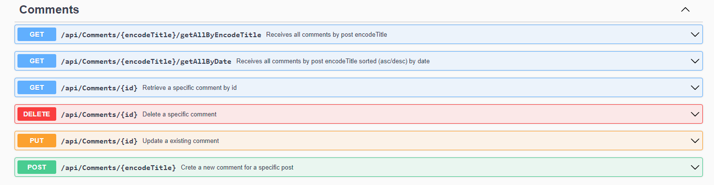
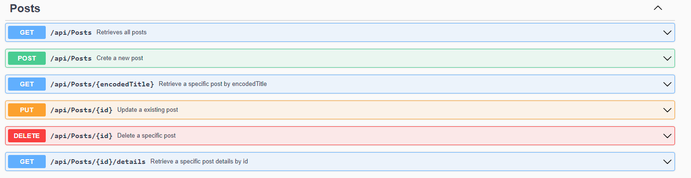

# Blogger
The Blogger Project with login and registration system is a simple, interactive website that allows users to create, view and comment on blog posts. This project uses popular web technologies to provide the functionality of logging in, registering and publishing posts. This is a great example of how to create a basic social system based on a simple technology stack.

## Table of Contents
* [Technologies Used](#technologies-used)
* [Features](#features)
* [Screenshots](#screenshots)
* [Project Status](#project-status)
* [Contact](#contact)

## Technologies Used
- .Net - version 7.0
- Asp Net Core - version 7.0.3
- Auto Mapper - version 12.0.0
- MediatR - version 12.0.1
- Entity Framework Core - version 7.0.3
- Fluent Validation - version 11.0
- NLog - version 5.2.4
  
### Architecture 
- Clean Architecture with CQRS

### Project Patterns
- Mediator

## Features

### Accounts Controller
- Register user account
- Login to user account
- Delete user account
- Get users accounts

### Comments Controller
- Create comment
- Delete comment
- Update comment
- Get comments
- Get comment by Id
- Get comments by DateQuery

### Posts Controller
- Create post
- Delete post
- Update post
- Get post by Id
- Get post by EncodedTitle
- Get post details

## Screenshots

### Swagger

## Project Status
Project is: **Finished**.

## Contact
Created by [@Igossx](https://www.github.com/igossx) - feel free to contact me!

 
